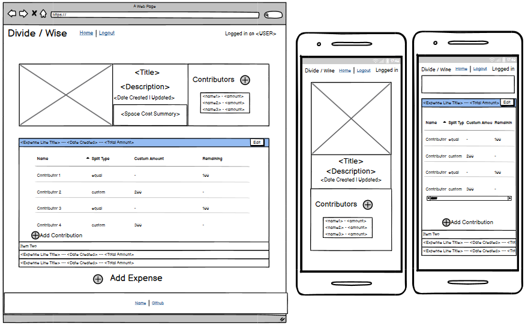
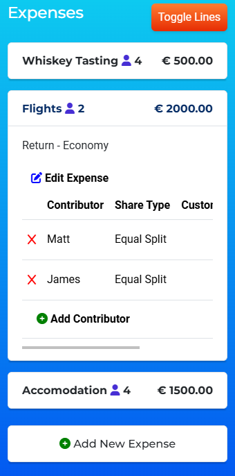
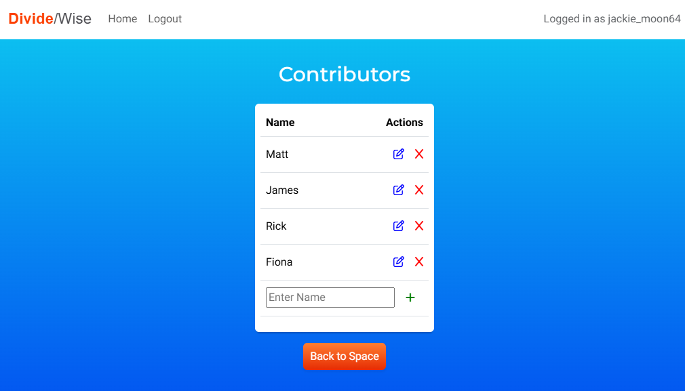

# **DivideWise**

DivideWise is a web application designed to help users efficiently track and manage shared expenses. Users can create shared expense spaces, add contributors, split costs, and assign contribution amounts.

The responsive website allows users to manage expenses seamlessly, making it ideal for shared living spaces, group vacations, and collaborative events.

# **[Link to Live Site](https://dividewise-a9f60e19a4b9.herokuapp.com/)**  

*This project was built as part of a full-stack development portfolio.*

**Built by Jack Brosnan**

---

# **Table of Contents**

1. [UX](#ux)
   - [Overview](#overview)
   - [Entity Relationship Model](#entity-relationship-model)
   - [Wireframes](#wireframes)
2. [Agile Development](#agile-development)
   - [GitHub Project Board](#github-project-board)
   - [User Stories](#user-stories)
3. [Features and Responsiveness](#features-and-responsiveness)  
4. [Future Enhancements](#future-enhancements)  
5. [Technology Used](#technology-used) 
6. [Testing and Validation](#testing-and-validation)  
   - [Manual Testing Results](#manual-testing-results)
   - [Automated Testing](#automated-testing)
7. [Known Bugs and Issues for Future Review](#known-bugs-and-issues-for-future-review) 
8. [Deployment](#deployment)
   - [Deployment Steps](#deployment-steps)
   - [Forking the Repository](#forking-the-repository)
   - [Creating a Clone of the Repository](#creating-a-clone-of-the-repository)
9. [Credits and Acknowledgements](#credits-and-acknowledgements)

---

# **UX**

## **Overview**
DivideWise is tailored for users who engage in shared expenses, providing a seamless way to manage group costs. The app simplifies tracking contributions, ensuring transparency and fairness.

## Entity Relationship Model

I used draw.io to create my database entity relationship diagrams. See diagram and supporting text below.

### Relationships

#### ExpenseSpace ↔ ExpenseLine

- **A space can have multiple expense lines (1-to-many).**
- Each expense line belongs to one space.
- **Relationship:** `ExpenseSpace (1) ↔ ExpenseLine (∞)`

---

#### ExpenseSpace ↔ Contributor

- **A space can have multiple contributors (1-to-many).**
- Each contributor belongs to one space.
- **Relationship:** `ExpenseSpace (1) ↔ Contributor (∞)`

---

#### ExpenseLine ↔ Contribution

- **An expense line can have multiple contributions (1-to-many).**
- Each contribution is tied to one expense line.
- **Relationship:** `ExpenseLine (1) ↔ Contribution (∞)`

---

#### Contributor ↔ Contribution

- **A contributor can have multiple contributions (1-to-many).**
- Each contribution is associated with one contributor.
- **Relationship:** `Contributor (1) ↔ Contribution (∞)`

## Wireframes

The following wireframes illustrate the design and functionality envisioned for key pages and views in the application. Each layout ensures a responsive and user-friendly experience across various devices, including mobile.

### Index Page (Desktop and Mobile)

The index page serves as the main dashboard for users, displaying a list of their created spaces. It includes clear navigation options and responsive design to ensure seamless accessibility on smaller screens.

---

### View Space (Desktop and Mobile)

The view space page provides detailed information about a specific space, including the associated expense lines and contributors. It ensures clear and organized presentation of data.

---

### Forms and Confirmation Messages

The wireframes for the forms include layouts for creating or editing spaces, expenses, and contributors. These forms prioritize simplicity and clarity for user input.

A confirmation message appears on the index page after actions like adding or editing spaces. This feedback ensures users are informed about the success of their actions.

---

## **Agile Development**

### GitHub Project Board

The [GitHub Project Board](https://github.com/users/jack-brosnan/projects/8/views/1) was leveraged to efficiently manage tasks and monitor progress throughout the development process. The board was organized into the following columns:

- **To Do**: Tasks planned for the current development cycle.
- **In Progress**: Tasks currently being worked on.
- **Done**: Tasks that have been completed.
- **Won't Do**: Deferred tasks to be addressed in future iterations.

This structure provided clear visibility into the project's status and helped prioritize work effectively.

### Benefits of the Agile Approach

- **Prioritized Stories**: Used the MoSCoW methodology to focus on what matters most.
- **Flexibility**: Allowed adjustments to scope and priorities as the project evolved.
- **Focused Delivery**: Ensured development stayed aligned with user stories to meet user needs.
- **Task Tracking**: Provided a comprehensive view of completed, ongoing, and upcoming tasks.

By utilizing GitHub Project Boards, task management was streamlined, ensuring the timely delivery of the Minimum Viable Product (MVP).

[View the GitHub Project Board](https://github.com/users/jack-brosnan/projects/8/views/1)

## **User Stories**
### User Story 1: User Authentication
As a **user**, I can **register and log in to the app** so that **my data and spaces are securely accessible only to me.**

#### Acceptance Criteria
- Users must be able to register with an email and password.
- Logged-in users can access their personal dashboard.
- Invalid login attempts display error messages (e.g., wrong password, unregistered email).

---

### User Story 2: Create and Manage Spaces
As a **user**, I can **create, view, update, and delete spaces** so that **I can organize my expenses by event or activity.**

#### Acceptance Criteria
- Users can create a new space by entering a name and optional description.
- A list of all spaces is displayed on the user's dashboard.
- Users can update or delete spaces they created, with confirmation prompts for deletions.

---

### User Story 3: Add and Manage Expenses
As a **user**, I can **add expenses to a space** so that **I can track costs associated with specific events.**

#### Acceptance Criteria
- Expenses must include a title, amount.
- Users can associate contributors with each expense and define how costs are split.
- Users can view, edit, or delete any expense within their spaces.

---

### User Story 4: Expense Split View
As a **user**, I can **view how expenses are split among contributors** so that **I know who owes what.**

#### Acceptance Criteria
- Each expense can display the breakdown of contributors and their owed amounts.
- Split calculations are accurate based on predefined rules (equal or custom).
- The total split amount matches the expense amount.

---

### User Story 5: View List of Spaces on the Homepage
As a **user**, I can **see a list of all spaces I have created on the homepage** so that **I can quickly access and manage my existing spaces.**

#### Acceptance Criteria
- The homepage displays a list of spaces with their names and descriptions.
- Each space in the list has a clickable link to view its details.
- The list is paginated if there are many spaces and sorted by date created.

---

### User Story 6: View Space Summary
As a **user**, I can **view a summary of total expenses and balances for a space** so that **I can understand the overall financial picture.**

#### Acceptance Criteria
- Users can access the summary from the space view.
- The summary dynamically updates when expenses or contributors change.

---

### User Story 7: View List of Expenses in a Space
As a **user**, I can **see a list of all expenses associated with a specific space** so that **I can review the expenses for that event or activity.**

#### Acceptance Criteria
- Clicking on a space from the dashboard displays a detailed view with a list of all expenses associated.
- Each expense in the list shows a title, description (if provided), date (if provided), and amount.

---

### User Story 8: Add and Manage Contributors
As a **user**, I can **add and manage contributors assigned to a space** so that **I can see who is involved and split expenses accurately.**

#### Acceptance Criteria
- Users can add contributors to a space by entering their name and an email address (if provided).
- Users can view the list of contributors assigned to a space.
- Users can update or remove contributors from the space. A confirmation prompt is displayed for removals.

---

# **Features and Responsiveness**

## Welcome Page:
- A welcoming and visually appealing header to introduce users to DivideWise.
- Prominent buttons to either log in or register, making navigation straightforward for new and returning users.
- The layout adjusts seamlessly across devices, including desktops, tablets, and mobile screens.
- Clear messaging to describe the app’s purpose.

|  | 
|---|---|

## Home Page:
- Displays a list of expense spaces for logged-in users.
- Provides quick navigation to view, edit, or delete expense spaces.
- Displays the total expense amount for each expense space.
- Includes a responsive design to ensure usability on various screen sizes.

|  |  |  |
|---|---|---|

## View Space Page:
- Displays detailed information about the selected expense space.
- Lists associated expense lines in descending order of creation.
- Shows contributors and their contributions for the expense space.
- Includes options to add, edit, or delete expense lines and contributors.

|  |  |  |
|---|---|---|

## Custom Filter
- The custom filter feature on the **View Space Page** allows users to streamline their view by selecting contributors. It dynamically updates the visible expense lines and contribution rows based on the selected filters, ensuring an intuitive and user-focused experience.
- The filter layout adjusts seamlessly for desktop and mobile views.

|  | 
|---|---|

## Add Contribution Page:
- Displays a list of unassigned contributors for the selected expense line.
- Allows users to select contributors and assign them to the expense line.
- Provides a cancel button to return to the view space page without adding contributors.
- Displays a success message upon successful addition of contributors.

 
---

## Edit Contributor Page:
- Lists all contributors associated with the selected expense space.
- Provides options to edit or delete contributors.
- Includes a form to add new contributors to the expense space.
- Ensures validation for contributor details before saving changes.

 
---

## Edit Custom Amount Page:
- Displays a form to update the custom amount for a specific contribution.
- Ensures the total custom amounts do not exceed the expense line amount.
- Displays a calculated maximum allowable amount for user reference.
- Includes validation and provides clear error messages for invalid input.

 
---

##### [ Back to Top ](#table-of-contents)

---

# **Future Enhancements**

1. **Analytics**: Integrate charts for expense insights.
2. **Multi-Currency Support**: Allow users to manage expenses in various currencies.

---

# **Technology Used**

- **Frontend**: HTML5, CSS3, JavaScript, Bootstrap
- **Backend**: Django (Python)
- **Database**: PostgreSQL
- **Hosting**: Heroku, Cloudinary (media storage)
- **Version Control**: Git and GitHub
- **Wireframes**: Balsamiq

---

# **Testing and Validation**

## **Responsiveness**
The app was tested across multiple devices (desktop, tablet, mobile) using Chrome DevTools.

### **CSS Validation**
The CSS files were validated using the [W3C CSS Validation Service](https://jigsaw.w3.org/css-validator/).  
- **Result**: All styles passed validation successfully with no errors. Confirms that the CSS adheres to web standards and ensures consistent rendering across browsers.

 

---

### **HTML Validation**
The templates were validated using the [W3C Markup Validation Service](https://validator.w3.org/).  
- **Initial Issues**: Some templates showed parse errors during initial tests, particularly due to inline JavaScript.

- **Resolution**:
  1. Cleared the W3C cache and re-ran the validation tests. This resolved persistent parse errors.
     
  2. Updated inline JavaScript and ensured all `<script>` tags were properly formatted and closed.
- **Result**: All templates passed validation with no remaining errors or warnings.

---

### **WCAG Contrast Checker**
The site was tested using the [WebAIM Contrast Checker](https://webaim.org/resources/contrastchecker/) to ensure compliance with WCAG (Web Content Accessibility Guidelines).

- **General Results**:  
  The majority of the site achieved **high contrast ratings**, ensuring good readability and accessibility for users with visual impairments.

- **Exceptions Identified**:
  1. **Welcome Message Tagline**:  
     - The tagline text is compared against the background color rather than the image overlay it resides on.
     - Result: Contrast ratio does not meet WCAG standards in this scenario.

      
    
  2. **Contributor Filter Text**:  
     - Black text in the contributor filter is compared against the container's dark background instead of the white filter background.
     - Result: Contrast ratio does not meet WCAG standards for text visibility.

      

- **Planned Updates**:
  These exceptions will be reviewed in future iterations to ensure full compliance with WCAG accessibility standards while maintaining the design aesthetics of the site.

  ### **PEP 8 Compliance**

- The Python codebase adheres to **PEP 8** standards, ensuring readability, consistency, and maintainability. Key practices include proper indentation, adherence to naming conventions, grouping and ordering imports, and meaningful comments and docstrings. The code was validated using Code institute's **CI Python Linter**, with all significant warnings and errors addressed. This adherence promotes clean and organized code, improving maintainability and collaboration.

## Additional Security checks:
- Restricts access to expense spaces and features for unauthorized users.
- Validates form inputs to prevent malicious submissions.
- Prevents users from accessing or modifying data they do not own.
- Redirects unauthorized users attempting restricted actions to the login page.

### Manual Testing Results

#### **Viewing Expense Spaces**

| **Test**                                                      | **Result** |
|---------------------------------------------------------------|------------|
| Displays a list of expense spaces for logged-in users         | Pass       |
| Hides expense spaces for anonymous users                      | Pass       |
| Filters expense spaces by the logged-in user                  | Pass       |

---

#### **Adding Space**

| **Test**                                                      | **Result** |
|---------------------------------------------------------------|------------|
| Displays a form to add a new expense space                    | Pass       |
| Validates input fields (e.g., name, description)              | Pass       |
| Displays success message on valid form submission             | Pass       |
| Redirects to the homepage after successful form submission    | Pass       |
| Handles file uploads for space image                         | Pass       |

---

#### **Editing Space**

| **Test**                                                      | **Result** |
|---------------------------------------------------------------|------------|
| Displays pre-filled form for editing an expense space         | Pass       |
| Updates expense space details on valid form submission        | Pass       |
| Validates fields (e.g., name, description)                    | Pass       |
| Displays success message on update                           | Pass       |
| Redirects to homepage after updating the space                | Pass       |
| Restricts access to expense spaces not owned by the user      | Pass       |

---

#### **Delete Space**

| **Test**                                                      | **Result** |
|---------------------------------------------------------------|------------|
| Deletes the specified expense space                          | Pass       |
| Displays success message upon deletion                       | Pass       |
| Redirects to the homepage after deletion                     | Pass       |
| Restricts deletion of spaces not owned by the user            | Pass       |

---

#### **View Space**

| **Test**                                                      | **Result** |
|---------------------------------------------------------------|------------|
| Displays the details of a selected expense space             | Pass       |
| Lists associated expense lines in descending order by date    | Pass       |
| Displays contributors associated with the space               | Pass       |
| Restricts access to spaces not owned by the user              | Pass       |

---

#### **Manage Contributors**

| **Test**                                                      | **Result** |
|---------------------------------------------------------------|------------|
| Displays a list of contributors for a specific expense space | Pass       |
| Allows editing of existing contributor details               | Pass       |
| Adds a new contributor to the expense space                  | Pass       |
| Deletes a contributor from the expense space                 | Pass       |
| Displays success messages for add, edit, and delete actions  | Pass       |
| Restricts access to contributors not associated with the user | Pass       |

#### **Add Expense Line**

| **Test**                                                      | **Result** |
|---------------------------------------------------------------|------------|
| Displays a form to add a new expense line                    | Pass       |
| Validates input fields (e.g., title, amount, due date)        | Pass       |
| Displays success message upon successful addition            | Pass       |
| Redirects to the associated expense space                    | Pass       |

#### **Edit Expense Line**

| **Test**                                                      | **Result** |
|---------------------------------------------------------------|------------|
| Displays a pre-filled form to edit an expense line            | Pass       |
| Updates expense details on valid submission                  | Pass       |
| Validates input fields (e.g., title, amount, due date)        | Pass       |
| Displays success message on update                           | Pass       |
| Redirects to the associated expense space after update        | Pass       |

#### **Delete Expense Line**

| **Test**                                                      | **Result** |
|---------------------------------------------------------------|------------|
| Deletes the specified expense line                           | Pass       |
| Displays success message upon deletion                       | Pass       |
| Redirects to the associated expense space                    | Pass       |

#### **Edit Custom Amount**

| **Test**                                                      | **Result** |
|---------------------------------------------------------------|------------|
| Displays a form to edit the custom amount for a contribution | Pass       |
| Validates the custom amount does not exceed the total expense | Pass       |
| Displays success message on update                           | Pass       |
| Redirects to the associated expense space after update        | Pass       |

#### **Add Contribution Line**

| **Test**                                                      | **Result** |
|---------------------------------------------------------------|------------|
| Displays a list of unassigned contributors                  | Pass       |
| Adds selected contributors to the expense line               | Pass       |
| Displays success message after adding contributors           | Pass       |
| Redirects to the associated expense space after addition      | Pass       |

#### **Delete Contribution Line**

| **Test**                                                      | **Result** |
|---------------------------------------------------------------|------------|
| Deletes the specified contribution                           | Pass       |
| Displays success message upon deletion                       | Pass       |
| Redirects to the associated expense space                    | Pass       |

---

### **Test Scripts Developed with AI**

To ensure the robustness of the application, comprehensive test scripts were developed with the assistance of AI tools. These scripts were designed to automate the testing of key application functionalities, including models, views, forms, and URLs. 

#### **Key Highlights:**

- **Model Tests:** Validated database interactions, ensuring accurate calculations for fields like `total_expense` and `remaining_share`. Test cases also verified the integrity of relationships between models (e.g., ExpenseSpace, ExpenseLine, Contributor, and Contribution).
- **View Tests:** Confirmed proper routing, template rendering, and response codes for various user actions. Ensured that permissions and access controls worked as intended.
- **Form Tests:** Tested form validation logic, including custom validation methods such as maximum allowable custom amounts and required fields.
- **URL Tests:** Validated that URLs mapped correctly to their corresponding views, ensuring seamless navigation across the application.

AI assistance streamlined the process by Providing optimized test logic to minimize redundancy offering quick corrections for common testing errors or edge cases.

# **Known Bugs and Issues for Future Review**

1. **Console Log Warnings for Cloudinary Images**:  
   When loading Cloudinary-hosted images, some console warnings indicate that the images are being sent with an HTTP prefix instead of HTTPS. While this does not disrupt functionality, it may impact security and browser compatibility in the future.

   

2. **Templates Not Linking to Local JavaScript File**:  
   Attempts to include local JavaScript files failed. As a workaround, relevant scripts were embedded directly into the templates.

These issues will be addressed in a future update to improve performance, maintainability, and compliance with best practices.

---

### Deployment Steps:

#### Creating the Heroku App

- Begin by signing up or logging in to Heroku.
- In the Heroku Dashboard, click on 'New' and then select 'Create New App'.
- Choose a unique name for your project, like "SplitBuddy".
- Select the EU region.
- Click on "Create App".
- In the "Deploy" tab, choose GitHub as the deployment method.
- Connect your GitHub account and find/connect your GitHub repository.

#### Setting Up Environment Variables

- Create `env.py` in the top level of the Django app.
- Import `os` in `env.py`.
- Set up necessary environment variables in `env.py`, including the secret key and database URL.
- Update `settings.py` to use environment variables for secret key and database.
- Configure environment variables in the Heroku "Settings" tab under "Config Vars".
- Migrate the models to the new database connection in the terminal.
- Configure static files and templates directories in `settings.py`.
- Add Heroku to the `ALLOWED_HOSTS` list.

#### Creating Procfile and Pushing Changes

- Create a `Procfile` in the top level directory.
- Add the command to run the project in the `Procfile`.
- Add, commit, and push the changes to GitHub.

#### Heroku Deployment

- In Heroku, navigate to the Deployment tab and deploy the branch manually.
- Monitor the build logs for any errors.
- Upon successful deployment, Heroku will display a link to the live site.
- Make sure to resolve any deployment errors by adjusting the code as necessary.

### Forking the Repository

Forking the GitHub Repository allows you to create a copy of the original repository without affecting it. Follow these steps:

- Log in to GitHub or create an account.
- Visit the [repository link](https://github.com/jack-brosnan/DivideWise).
- Click on "Fork" at the top of the repository.

### Creating a Clone of the Repository

Creating a clone enables you to make a local copy of the repository. Follow these steps:

- Navigate to the [DivideWise](https://github.com/jack-brosnan/DivideWise) repository.
- Click on the <>Code button.
- Select the "HTTPS" option under the "Local" tab and copy the URL.
- Open your terminal and change the directory to your desired location.
- Use `git clone` followed by the copied repository URL.

---

### **Credits and Acknowledgements**

---

### **Resources**
- **Tony Teaches Tech**: Provided guidance on hosting and deployment practices.  
  [Watch the tutorial](https://www.youtube.com/watch?v=opjyyXoqrxg&t=1093s&ab_channel=TonyTeachesTech)  

- **Cloud With Django**: Assisted in understanding Django project configuration and database integration.  
  [Watch the video](https://www.youtube.com/watch?v=pqWyUAT38e0&t=2806s&ab_channel=CloudWithDjango)  

- **Landing Page Template**: The CSS template for the landing page was adapted from [TemplateMo](https://templatemo.com/).

- **ChatGPT and Stack Overflow**: Instrumental in resolving bugs, generating test scripts, and optimizing functionality.

- **Code Institute LMS**

---

### **Guidance and Inspiration**
- **Custom Button Design**: The button design was inspired by the clean and modern style of **FlightConnections.com**.
- **EasySplit App**: The colorful design and simplified UI of this expense-splitting app influenced the aesthetic and usability of DivideWise.
- **Code Institute LMS**: Provided consistent guidance and structured templates throughout the project.

---

### **Special Thanks**
- **David Calikes**: For his support, and guidance as a course facilitator.  
- **Kevin Loughrey**: For his expert advice and dedicated SME sessions.  
